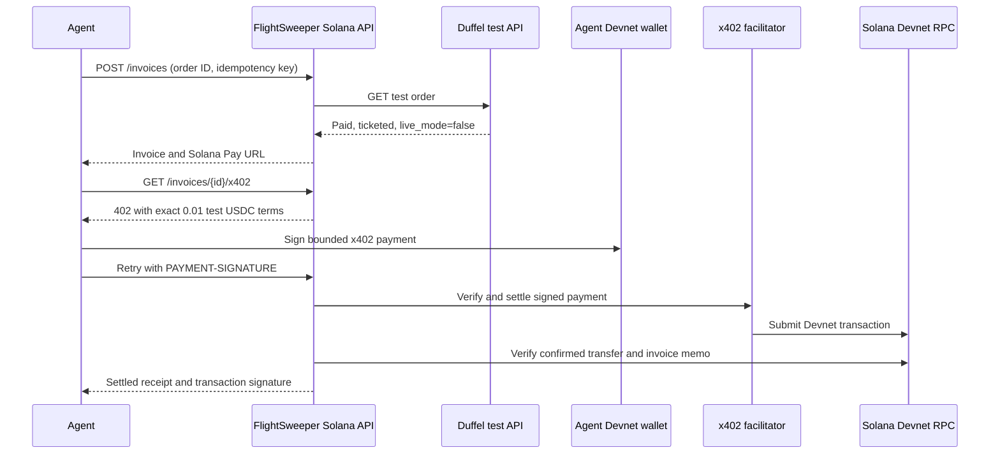

# FlightSweeper - Solana

FlightSweeper lets an agent pay a 0.01 Devnet USDC test-token fee after a confirmed Duffel test booking and receive a verified receipt.

The API offers both a Solana Pay transfer request and an x402 V2 payment challenge for one invoice. It returns the same receipt on retry. The one-page website at [flightsweeper-solana.vercel.app](https://flightsweeper-solana.vercel.app) shows recorded proof and the demo video. Traveler approval and airfare payment remain separate.

This was built for the [September 30, 2026 Agent Hackathon](https://luma.com/agent-hackathon). The event asks for a product, service, or API that an agent would buy. Its public page does not specify a required payment protocol, public repository, or judging rubric. This demo uses Solana Pay and x402 V2; it does not use Pay.sh.

## What this repository contains

The agent pays a demonstration service fee after Duffel reports a paid, ticketed test order. The traveler's approval and airfare belong to a separate hosted booking flow. **No live booking or real-money payment occurs here.**

| File                     | Role                                                                                                     |
| ------------------------ | -------------------------------------------------------------------------------------------------------- |
| `src/server.mjs`         | Local agent API, Duffel order check, invoice storage, x402 V2 settlement, and Devnet reconciliation.     |
| `src/payment.mjs`        | Solana Pay URL and transaction verification rules.                                                       |
| `scripts/agent.mjs`      | Agent client that creates an invoice, reads its receipt, previews x402 terms, and checks retry behavior. |
| `scripts/x402-agent.mjs` | Bounded Devnet payer that signs an x402 V2 payment with a local disposable wallet seed.                  |
| `src/*.test.mjs`         | Checks Solana Pay verification, x402 memo rules, the x402 V2 challenge, recovery, and settled retry.     |
| `web/`                   | One-page website that shows the recorded test run. It makes no API calls.                                |

The [Duffel logo](https://duffel.com/) and [Solana mark](https://solana.com/branding) in `web/` identify the two test services. Those marks belong to their owners and are excluded from this repository's MIT license. Their use does not imply endorsement.

An integrated fee prototype also exists in the separate FlightSweeper working tree at `packages/backend/src/agent-execution-fee-service.ts` and `apps/web/app/api/agent/execution-fee/`. That prototype uses a local booking fixture for its verified demo. Its code and the hosted traveler flow are **not** included here. This repository runs its own fee demo without that application, but it requires a Duffel test order and a Devnet payer wallet.

## Run locally

Prerequisites: [Bun 1.3+](https://bun.com/docs/installation), a `duffel_test_` token, a paid and ticketed [Duffel Airways (`ZZ`) test order](https://duffel.com/docs/api/overview/test-mode/duffel-airways), and two Devnet wallets. Fund the payer with test SOL and [Circle Devnet USDC](https://faucet.circle.com/). The recipient must have an associated token account for Circle's [Devnet USDC mint](https://developers.circle.com/stablecoins/usdc-contract-addresses), `4zMMC9srt5Ri5X14GAgXhaHii3GnPAEERYPJgZJDncDU`. Keep wallet signing keys outside this server and the repository.

1. Copy `.env.example` to `.env.local`, set its permissions to `600`, and fill in `DUFFEL_TEST_TOKEN`, a random `AGENT_API_TOKEN` of at least 32 characters, and `FEE_RECIPIENT`. Never commit `.env.local`.
2. Run `bun install --frozen-lockfile`, then `bun run start`. Open `http://127.0.0.1:8787` for the website. The API binds to `127.0.0.1:8787` and stores invoices in the ignored `.data/invoices.sqlite` file.
3. In another terminal, set `AGENT_API_TOKEN` to the same local token and run `bun scripts/agent.mjs <Duffel test order ID> <UUID> --watch`. The agent client prints a `solana:` URL and polls for settlement for up to 30 seconds. Pay that URL with a wallet set to **Devnet**, or submit the transaction signature to `POST /invoices/{id}/settle`.
4. Run the same agent command again. It returns the same invoice and transaction signature. It provides no second payment URL after settlement.

For x402 V2, create an unpaid invoice with `bun scripts/agent.mjs <Duffel test order ID> <UUID> --x402`. The `--x402` option prints the official `PAYMENT-REQUIRED` terms without signing or paying. To make one Devnet payment, set `SOLANA_PAYER_SEED_FILE` to a disposable 32-byte seed file and run `bun scripts/x402-agent.mjs <Duffel test order ID> <same UUID>`. That client requires the exact Devnet network, USDC mint, 10,000 base units, configured recipient, and invoice memo before it signs. Run it again with the same UUID to read the settled receipt without a second payment; a settled replay does not need the seed. Keep the seed outside Git and use a dedicated test wallet.

### Configuration

| Variable                  | Used by                  | Purpose                                                                                                              |
| ------------------------- | ------------------------ | -------------------------------------------------------------------------------------------------------------------- |
| `DUFFEL_TEST_TOKEN`       | Server                   | Duffel test-mode token (`duffel_test_…`).                                                                            |
| `AGENT_API_TOKEN`         | Server, both scripts     | Bearer token for `/invoices` routes. Use at least 32 random characters.                                              |
| `FEE_RECIPIENT`           | Server, `x402-agent.mjs` | Devnet wallet that receives the fee. The x402 client refuses terms that pay a different address.                     |
| `PORT`, `HOST`, `DB_PATH` | Server                   | Defaults: `8787`, `127.0.0.1`, `.data/invoices.sqlite`.                                                              |
| `API_BASE`                | Both scripts             | API origin. Default: `http://127.0.0.1:8787`.                                                                        |
| `SOLANA_PAYER_SEED_FILE`  | `x402-agent.mjs`         | Path to a file with exactly 32 raw seed bytes for a disposable Devnet payer. Not needed to replay a settled receipt. |

The Solana Pay URL does **not** select a cluster. Check that the wallet uses Devnet before sending. Devnet tokens have no real value and the network can reset.

`scripts/agent.mjs` creates invoices and reads receipts without a wallet key. `scripts/x402-agent.mjs` reads a disposable wallet seed from the path you provide and signs only a payment that matches its fee policy. Keep production signing keys and spending limits outside this demo server.

`bun test` runs eleven local checks. They do not contact Duffel or Solana. The x402 tests cover the V2 challenge, uncertain outcome, `/recover`, bearer authentication, and settled retry; they do not simulate facilitator settlement or concurrent payment attempts. A full payment demo also needs the credentials, test order, wallet, and network access listed above.

## Deploy the sandbox

The `Dockerfile` packages the Bun API and website in one service. [Railway supports Dockerfiles](https://docs.railway.com/builds/dockerfiles), [persistent volumes](https://docs.railway.com/volumes), and a [public domain](https://bun.sh/guides/deployment/railway). This repository has not been deployed from this configuration. Hosting may incur charges.

Prerequisites: a Railway account connected to the GitHub repository, a usable Duffel test token, an agent API token, and a Devnet recipient wallet with a Devnet USDC token account. Keep all secrets in Railway variables, outside Git and the browser source.

1. Connect `admin-raintree/flightsweeper-solana` as a new Railway service. Railway should detect the root `Dockerfile`.
2. Attach one volume to the service at `/data` before the first deployment. The server writes its SQLite database there. Without the volume, invoice state disappears on redeploy.
3. Add `DUFFEL_TEST_TOKEN`, `AGENT_API_TOKEN` (at least 32 random characters), and `FEE_RECIPIENT` as service variables. The image sets `HOST=0.0.0.0` and `DB_PATH=/data/invoices.sqlite`; Railway provides `PORT`.
4. Set the service health-check path to `/health`. Deploy the service and confirm that this endpoint returns `{"status":"ok","environment":"solana_devnet_test"}`.
5. Generate a Railway public domain. Open the HTTPS URL and check that the website loads. An unauthenticated `POST /invoices` must return `401`.
6. Run `scripts/agent.mjs` with `API_BASE` set to the HTTPS domain. Create an invoice for a paid, ticketed Duffel test order. Send the test-token payment with a Devnet wallet, then check the receipt.

The public website shows a recorded test run even when the new deployment has an empty database. Its recorded receipt is not a live API response. Do not present a fresh deployment as fully working until the end-to-end check in step 6 succeeds.

## Agent API

All `/invoices` requests require `Authorization: Bearer <AGENT_API_TOKEN>`.

| Request                                                                           | Result                                                                                                                                                                                                                                         |
| --------------------------------------------------------------------------------- | ---------------------------------------------------------------------------------------------------------------------------------------------------------------------------------------------------------------------------------------------- |
| `POST /invoices` with `{ "orderId": "ord_...", "idempotencyKey": "<UUID>" }`      | Verifies the Duffel test order and creates one invoice. A repeated key returns the same invoice. A second key for the same order returns `409`.                                                                                                |
| `GET /invoices/{invoiceId}`                                                       | Reconciles the relevant payment path and returns `awaiting_payment`, `pending_confirmation`, `payment_outcome_unknown`, or `settled`.                                                                                                          |
| `POST /invoices/{invoiceId}/settle` with `{ "signature": "<Devnet signature>" }`  | Verifies a submitted transaction and returns its receipt.                                                                                                                                                                                      |
| `GET /invoices/{invoiceId}/x402`                                                  | Returns an x402 V2 `402` challenge with `PAYMENT-REQUIRED`. A signed retry with `PAYMENT-SIGNATURE` settles the fee and returns `PAYMENT-RESPONSE` plus the receipt. A settled invoice returns its existing receipt without another challenge. |
| `POST /invoices/{invoiceId}/recover` with `{ "signature": "<Devnet signature>" }` | Recovers an uncertain x402 settlement from a confirmed transaction with the matching invoice memo, amount, mint, recipient, and payer.                                                                                                         |
| `GET /health`                                                                     | Local health check.                                                                                                                                                                                                                            |

The server checks the Devnet genesis hash and a confirmed transaction. Solana Pay settlement requires the invoice reference, Devnet USDC mint, exact 10,000 base-unit increase in the recipient’s token balance, and one identifiable token payer. The x402 facilitator verifies the signed payload before settlement. A settled invoice stores one signature.

If x402 settlement returns an uncertain result, the invoice becomes `payment_outcome_unknown` and stops offering payment terms. `GET /invoices/{invoiceId}` scans the 200 most recent confirmed transactions for each recipient Devnet USDC token account and verifies the invoice memo and transfer. If no x402 payment is found, it also checks the Solana Pay reference. If the transaction is older, submit its signature to `/recover`. Do not sign or send a new payment while this status persists; `scripts/x402-agent.mjs` stops with this instruction. If the facilitator rejected the transfer and no transaction exists, an operator must inspect the attempt before resetting that invoice; this demo has no automatic reset. Solana Pay status reads scan the ten most recent transactions for the reference; submit the original signature if an older payment is missing from that scan.

The service binds to localhost, uses a single bearer token, and uses a public rate-limited RPC. It is a hackathon sandbox, not a production payment service. A live pilot needs tenant authorization, dedicated RPC, price and refund policy, operations, and a separate security review.

## Verified September 30 demo

- Duffel test order `ord_0000BAwfWWEr8QxS99s9Nb`, booking reference `7JUQCE`, was created with **Duffel test balance** outside this repository. The account owner can show it in the [Duffel test dashboard](https://app.duffel.com/flightbooker/test/orders/ord_0000BAwfWWEr8QxS99s9Nb).
- This standalone API issued invoice `fee_61a97467-5d89-4d2b-ab1c-c9db4e4742ea` with idempotency key `55555555-5555-4555-8555-555555555555`, then settled it with [Devnet transaction `5L4S8...kAYA`](https://explorer.solana.com/tx/5L4S8miXMB3qhiqvbtbCWAqWULhRw5h7wNT9CPy9LZHjGmCBGw2NPHwqFoJRsedrmrZWsPhTPzDZjZeapen3kAYA?cluster=devnet). The invoice lives in ignored local SQLite state; a fresh clone cannot replay this receipt without that state and a Duffel test token.
- A retry returned the same receipt and no payment URL. A second invoice for the same order returned `409`; an unauthenticated request returned `401`.
- A separate fresh database issued x402 invoice `fee_efced8d0-e1f2-4c08-8a4e-384ca96dd5a7` for the same existing Duffel test order. The bounded agent client paid 0.01 Devnet USDC through x402 V2. The [Devnet x402 transaction `pYJY1...xDza`](https://explorer.solana.com/tx/pYJY1RxR1opP6BJXLeCaujx1GgH3RL14GZLDyRfPFB3KnoZaR5H3vRp8VAqP4n8ZsGrGdN1W7Xek4ydzgiWxDza?cluster=devnet) contains the invoice memo. A separate recovery database found that transaction and restored the receipt. The final verifier also settled invoice `fee_b1f27645-457b-4e15-8d6b-4c624a6e9c96` in [Devnet transaction `5pqrQ...4rgJ`](https://explorer.solana.com/tx/5pqrQJZm3T5y2oMvwvun4x6YPHmKAanJMfXQ2rSP9vdGsXVuoVCqDDuFYwcm1aQ8AaEtAzAgEGVxopS1ythH4rgJ?cluster=devnet). Its receipt is saved in ignored `.data/x402-demo.sqlite`; a retry returned it without a second charge. The website proof card shows the earlier Solana Pay run.
- This proof uses a provider test order and Devnet tokens. It does **not** show FlightSweeper’s hosted traveler approval or airfare checkout end to end.

## Three-minute demo

On the original demo machine, start two local API processes before presenting: `PORT=18794 DB_PATH=.data/x402-preview.sqlite bun run start` for an unpaid challenge, and `PORT=18790 DB_PATH=.data/x402-demo.sqlite bun run start` for the settled receipt. These ignored databases are not in a fresh clone. Both processes need the local `.env.local` credentials.

1. **0:00–0:45:** Show the Duffel dashboard’s `Test mode` and confirmed order `7JUQCE`.
2. **0:45–1:45:** Run `API_BASE=http://127.0.0.1:18794 bun scripts/agent.mjs ord_0000BAwfWWEr8QxS99s9Nb bbbbbbbb-bbbb-4bbb-8bbb-bbbbbbbbbbbb --x402`. Point to the 10,000 base-unit price, Devnet USDC mint, recipient, and invoice memo.
3. **1:45–2:30:** Show the recorded [x402 Devnet transaction](https://explorer.solana.com/tx/5pqrQJZm3T5y2oMvwvun4x6YPHmKAanJMfXQ2rSP9vdGsXVuoVCqDDuFYwcm1aQ8AaEtAzAgEGVxopS1ythH4rgJ?cluster=devnet). On the demo machine, run `API_BASE=http://127.0.0.1:18790 bun scripts/x402-agent.mjs ord_0000BAwfWWEr8QxS99s9Nb aaaaaaaa-aaaa-4aaa-8aaa-aaaaaaaaaaaa` against `.data/x402-demo.sqlite`. Show the identical receipt without another payment.
4. **2:30–3:00:** Explain that the agent pays only the service fee; traveler approval and airfare remain separate. The demo uses a Duffel test order and Devnet test tokens.

Official references: [Duffel test mode](https://duffel.com/docs/api/overview/test-mode/duffel-airways), [Duffel order API](https://duffel.com/docs/api/v2/orders), [Solana x402 V2](https://solana.com/docs/payments/agentic-payments/x402), [Solana Pay transfer requests](https://solana.com/docs/tools/solana-pay/quickstart/transfer-requests), and [Solana Devnet](https://solana.com/docs/references/clusters).
