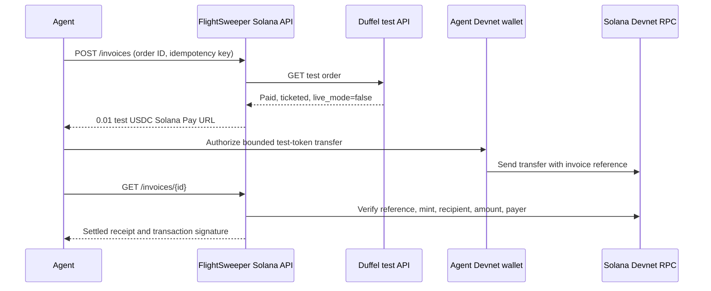

# FlightSweeper Solana

An agent can pay a **0.01 Devnet USDC test-token service fee** after a Duffel Airways **test-mode** order is confirmed. This standalone demo verifies the order with Duffel, issues a Solana Pay transfer request, verifies the Devnet payment, and returns an idempotent receipt. It does not create an airline order or handle traveler approval or airfare payment.

This was built for the [September 30, 2026 Agent Hackathon](https://luma.com/agent-hackathon). The event asks for a product, service, or API that an agent would buy. Its public page does not specify a required payment protocol, public repository, or judging rubric. This demo uses Solana Pay; it does not implement x402 or Pay.sh.

## What the agent buys

The agent pays FlightSweeper for confirmed booking execution. The service charges only after Duffel reports a paid, ticketed test order. The traveler’s approval and airfare are separate and must remain in the booking product’s hosted flow. **No live booking or real-money payment occurs here.**

## Run locally

Prerequisites: [Bun 1.3+](https://bun.com/docs/installation), a `duffel_test_` token, a paid and ticketed [Duffel Airways (`ZZ`) test order](https://duffel.com/docs/api/overview/test-mode/duffel-airways), and two Devnet wallets. Fund the payer with test SOL and [Circle Devnet USDC](https://faucet.circle.com/). The recipient must have an associated token account for Circle's [Devnet USDC mint](https://developers.circle.com/stablecoins/usdc-contract-addresses), `4zMMC9srt5Ri5X14GAgXhaHii3GnPAEERYPJgZJDncDU`. Keep wallet signing keys outside this server and the repository.

1. Copy `.env.example` to `.env.local`, set its permissions to `600`, and fill in `DUFFEL_TEST_TOKEN`, a random `AGENT_API_TOKEN` of at least 32 characters, and `FEE_RECIPIENT`. Never commit `.env.local`.
2. Run `bun run start`. The API binds to `127.0.0.1:8787` and stores invoices in the ignored `.data/invoices.sqlite` file. It has no package dependencies to install.
3. In another terminal, set `AGENT_API_TOKEN` to the same local token and run `bun scripts/agent.mjs <Duffel test order ID> <UUID> --watch`. The agent client prints a `solana:` URL and waits for settlement. Pay that URL with a wallet set to **Devnet**, or submit the transaction signature to `POST /invoices/{id}/settle`.
4. Run the same agent command again. It returns the same invoice and transaction signature. It provides no second payment URL after settlement.

The Solana Pay URL does **not** select a cluster. Check that the wallet uses Devnet before sending. Devnet tokens have no real value and the network can reset.

## Agent API

All `/invoices` requests require `Authorization: Bearer <AGENT_API_TOKEN>`.

| Request | Result |
|---|---|
| `POST /invoices` with `{ "orderId": "ord_...", "idempotencyKey": "<UUID>" }` | Verifies the Duffel test order and creates one invoice. A repeated key returns the same invoice. A second key for the same order returns `409`. |
| `GET /invoices/{invoiceId}` | Reconciles by the unique Solana Pay reference and returns `awaiting_payment`, `pending_confirmation`, or `settled`. |
| `POST /invoices/{invoiceId}/settle` with `{ "signature": "<Devnet signature>" }` | Verifies a submitted transaction and returns its receipt. |
| `GET /health` | Local health check. |

The server checks the Devnet genesis hash and a confirmed transaction. Settlement requires the invoice reference, Devnet USDC mint, exact 10,000 base-unit increase in the recipient’s token balance, and one identifiable token payer. A settled invoice stores one signature. If RPC is unavailable or a submitted transaction is pending, **do not send another transfer**. Retry the status read or submit the original signature. The status read scans the ten most recent transactions for the reference; submit the signature if an older payment is missing from that scan.

The service binds to localhost, uses a single bearer token, and uses a public rate-limited RPC. It is a hackathon sandbox, not a production payment service. A live pilot needs tenant authorization, dedicated RPC, price and refund policy, operations, and a separate security review.

## Verified September 30 demo

- Duffel test order `ord_0000BAwfWWEr8QxS99s9Nb`, booking reference `7JUQCE`, was created with **Duffel test balance** outside this repository. The account owner can show it in the [Duffel test dashboard](https://app.duffel.com/flightbooker/test/orders/ord_0000BAwfWWEr8QxS99s9Nb).
- This standalone API issued invoice `fee_61a97467-5d89-4d2b-ab1c-c9db4e4742ea` with idempotency key `55555555-5555-4555-8555-555555555555`, then settled it with [Devnet transaction `5L4S8...kAYA`](https://explorer.solana.com/tx/5L4S8miXMB3qhiqvbtbCWAqWULhRw5h7wNT9CPy9LZHjGmCBGw2NPHwqFoJRsedrmrZWsPhTPzDZjZeapen3kAYA?cluster=devnet).
- A retry returned the same receipt and no payment URL. A second invoice for the same order returned `409`; an unauthenticated request returned `401`.
- This proof uses a provider test order and Devnet tokens. It does **not** show FlightSweeper’s hosted traveler approval or airfare checkout end to end.

## Three-minute demo

1. **0:00–0:45:** Show the Duffel dashboard’s `Test mode` and confirmed order `7JUQCE`.
2. **0:45–1:45:** Run the agent client with the order ID and its original idempotency key. Show the separate test-token receipt and Devnet transaction.
3. **1:45–2:30:** Run it again. Show the identical invoice and signature, with no second payment URL.
4. **2:30–3:00:** Explain the boundary: the agent pays only the service fee; traveler approval and airfare remain separate. State the hosted checkout limitation above.

Official references: [Duffel test mode](https://duffel.com/docs/api/overview/test-mode/duffel-airways), [Duffel order API](https://duffel.com/docs/api/v2/orders), [Solana Pay transfer requests](https://solana.com/docs/tools/solana-pay/quickstart/transfer-requests), [Solana RPC transaction verification](https://solana.com/docs/rpc/http/gettransaction), and [Solana Devnet](https://solana.com/docs/references/clusters).
