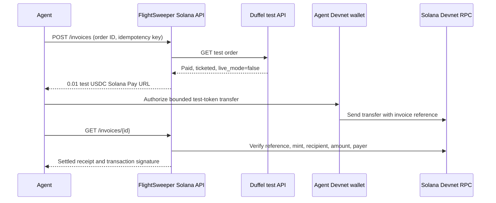

# FlightSweeper Solana

This standalone demo lets an agent pay a **0.01 Devnet USDC test-token service fee** after Duffel confirms a **test-mode** order. Its backend checks the order, issues a Solana Pay transfer request, verifies the Devnet payment, and returns a receipt that survives retries. The one-page website shows the recorded proof and provides a token-gated agent console. It does not create an airline order or handle traveler approval or airfare payment.

This was built for the [September 30, 2026 Agent Hackathon](https://luma.com/agent-hackathon). The event asks for a product, service, or API that an agent would buy. Its public page does not specify a required payment protocol, public repository, or judging rubric. This demo uses Solana Pay; it does not implement x402 or Pay.sh.

## What this repository contains

The agent pays a demonstration service fee after Duffel reports a paid, ticketed test order. The traveler's approval and airfare belong to a separate hosted booking flow. **No live booking or real-money payment occurs here.**

| File | Role |
|---|---|
| `src/server.mjs` | Local agent API, Duffel order check, invoice storage, and Devnet reconciliation. |
| `src/payment.mjs` | Solana Pay URL and transaction verification rules. |
| `scripts/agent.mjs` | Agent client that creates an invoice, reads its receipt, and checks retry behavior. |
| `src/payment.test.mjs` | Checks for the reference, mint, amount, and payer. |
| `web/` | One-page website and agent console. No API token is embedded in the website; an operator enters one to make API calls. |

An integrated fee prototype also exists in the separate FlightSweeper working tree at `packages/backend/src/agent-execution-fee-service.ts` and `apps/web/app/api/agent/execution-fee/`. That prototype uses a local booking fixture for its verified demo. Its code and the hosted traveler flow are **not** included here. This repository runs its own fee demo without that application, but it requires a Duffel test order and a Devnet payer wallet.

## Run locally

Prerequisites: [Bun 1.3+](https://bun.com/docs/installation), a `duffel_test_` token, a paid and ticketed [Duffel Airways (`ZZ`) test order](https://duffel.com/docs/api/overview/test-mode/duffel-airways), and two Devnet wallets. Fund the payer with test SOL and [Circle Devnet USDC](https://faucet.circle.com/). The recipient must have an associated token account for Circle's [Devnet USDC mint](https://developers.circle.com/stablecoins/usdc-contract-addresses), `4zMMC9srt5Ri5X14GAgXhaHii3GnPAEERYPJgZJDncDU`. Keep wallet signing keys outside this server and the repository.

1. Copy `.env.example` to `.env.local`, set its permissions to `600`, and fill in `DUFFEL_TEST_TOKEN`, a random `AGENT_API_TOKEN` of at least 32 characters, and `FEE_RECIPIENT`. Never commit `.env.local`.
2. Run `bun run start`. Open `http://127.0.0.1:8787` for the website. The API binds to `127.0.0.1:8787` and stores invoices in the ignored `.data/invoices.sqlite` file. It has no package dependencies to install.
3. In another terminal, set `AGENT_API_TOKEN` to the same local token and run `bun scripts/agent.mjs <Duffel test order ID> <UUID> --watch`. The agent client prints a `solana:` URL and polls for settlement for up to 30 seconds. Pay that URL with a wallet set to **Devnet**, or submit the transaction signature to `POST /invoices/{id}/settle`.
4. Run the same agent command again. It returns the same invoice and transaction signature. It provides no second payment URL after settlement.

The Solana Pay URL does **not** select a cluster. Check that the wallet uses Devnet before sending. Devnet tokens have no real value and the network can reset.

The included agent client creates invoices and reads receipts. It does not hold a wallet key or send a transfer. A separate bounded Devnet wallet sent the verified demo payment. An automated agent wallet can consume the same Solana Pay URL; its signing and spending policy remain outside this service.

`bun test` runs the four local payment verification tests. The tests do not contact Duffel or Solana. A full payment demo also needs the credentials, test order, wallets, and network access listed above.

## Deploy the sandbox

The `Dockerfile` packages the Bun API and website in one service. [Railway supports Dockerfiles](https://docs.railway.com/builds/dockerfiles), [persistent volumes](https://docs.railway.com/volumes), and a [public domain](https://bun.sh/guides/deployment/railway). This repository has not been deployed from this configuration. Hosting may incur charges.

Prerequisites: a Railway account connected to the private GitHub repository, a usable Duffel test token, an agent API token, and a Devnet recipient wallet with a Devnet USDC token account. Keep all secrets in Railway variables, outside Git and the browser source.

1. Connect `admin-raintree/flightsweeper-solana` as a new Railway service. Railway should detect the root `Dockerfile`.
2. Attach one volume to the service at `/data` before the first deployment. The server writes its SQLite database there. Without the volume, invoice state disappears on redeploy.
3. Add `DUFFEL_TEST_TOKEN`, `AGENT_API_TOKEN` (at least 32 random characters), and `FEE_RECIPIENT` as service variables. The image sets `HOST=0.0.0.0` and `DB_PATH=/data/invoices.sqlite`; Railway provides `PORT`.
4. Set the service health-check path to `/health`. Deploy the service and confirm that this endpoint returns `{"status":"ok","environment":"solana_devnet_test"}`.
5. Generate a Railway public domain. Open the HTTPS URL and check that the website loads. An unauthenticated `POST /invoices` must return `401`.
6. Enter the agent API token in the website's operator console, or use `scripts/agent.mjs` with `API_BASE` set to the HTTPS domain. Create an invoice for a paid, ticketed Duffel test order. Send the test-token payment with a Devnet wallet, then check the receipt.

The public website shows a recorded test run even when the new deployment has an empty database. Its recorded receipt is not a live API response. Do not present a fresh deployment as fully working until the end-to-end check in step 6 succeeds. The operator console keeps the entered token in page memory and sends it only to the same-origin API; use a trusted browser and HTTPS.

## Agent API

All `/invoices` requests require `Authorization: Bearer <AGENT_API_TOKEN>`.

| Request | Result |
|---|---|
| `POST /invoices` with `{ "orderId": "ord_...", "idempotencyKey": "<UUID>" }` | Verifies the Duffel test order and creates one invoice. A repeated key returns the same invoice. A second key for the same order returns `409`. |
| `GET /invoices/{invoiceId}` | Reconciles by the unique Solana Pay reference and returns `awaiting_payment`, `pending_confirmation`, or `settled`. |
| `POST /invoices/{invoiceId}/settle` with `{ "signature": "<Devnet signature>" }` | Verifies a submitted transaction and returns its receipt. |
| `GET /health` | Local health check. |

The server checks the Devnet genesis hash and a confirmed transaction. Settlement requires the invoice reference, Devnet USDC mint, exact 10,000 base-unit increase in the recipient’s token balance, and one identifiable token payer. A settled invoice stores one signature. If RPC is unavailable or a submitted transaction is pending, **do not send another transfer**. Retry the status read or submit the original signature. The status read scans the ten most recent transactions for the reference; submit the signature if an older payment is missing from that scan.

The service binds to localhost, uses a single bearer token, and uses a public rate-limited RPC. It is a hackathon sandbox, not a production payment service. A live pilot needs tenant authorization, dedicated RPC, price and refund policy, operations, and a separate security review.

## Verified September 30 demo

- Duffel test order `ord_0000BAwfWWEr8QxS99s9Nb`, booking reference `7JUQCE`, was created with **Duffel test balance** outside this repository. The account owner can show it in the [Duffel test dashboard](https://app.duffel.com/flightbooker/test/orders/ord_0000BAwfWWEr8QxS99s9Nb).
- This standalone API issued invoice `fee_61a97467-5d89-4d2b-ab1c-c9db4e4742ea` with idempotency key `55555555-5555-4555-8555-555555555555`, then settled it with [Devnet transaction `5L4S8...kAYA`](https://explorer.solana.com/tx/5L4S8miXMB3qhiqvbtbCWAqWULhRw5h7wNT9CPy9LZHjGmCBGw2NPHwqFoJRsedrmrZWsPhTPzDZjZeapen3kAYA?cluster=devnet). The invoice lives in ignored local SQLite state; a fresh clone cannot replay this receipt without that state and a Duffel test token.
- A retry returned the same receipt and no payment URL. A second invoice for the same order returned `409`; an unauthenticated request returned `401`.
- This proof uses a provider test order and Devnet tokens. It does **not** show FlightSweeper’s hosted traveler approval or airfare checkout end to end.

## Three-minute demo

1. **0:00–0:45:** Show the Duffel dashboard’s `Test mode` and confirmed order `7JUQCE`.
2. **0:45–1:45:** On the original demo machine, run `bun scripts/agent.mjs ord_0000BAwfWWEr8QxS99s9Nb 55555555-5555-4555-8555-555555555555`. Show the separate test-token receipt and Devnet transaction. This replay needs the original `.data/` state, a Duffel test token, and the local API token.
3. **1:45–2:30:** Run it again. Show the identical invoice and signature, with no second payment URL.
4. **2:30–3:00:** Explain the boundary: the agent pays only the service fee; traveler approval and airfare remain separate. State the hosted checkout limitation above.

Official references: [Duffel test mode](https://duffel.com/docs/api/overview/test-mode/duffel-airways), [Duffel order API](https://duffel.com/docs/api/v2/orders), [Solana Pay transfer requests](https://solana.com/docs/tools/solana-pay/quickstart/transfer-requests), [Solana RPC transaction verification](https://solana.com/docs/rpc/http/gettransaction), and [Solana Devnet](https://solana.com/docs/references/clusters).
